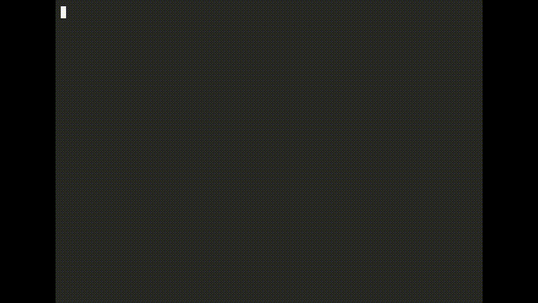

# BasicallyMythos — Claude Code reroute observability + fallback choice

[](LICENSE)
[](kimi-reroute-proxy.cjs)
[](kimi-reroute-proxy.cjs)
[](https://x.com/TEA_Resistance)
[](README_zh.md)

**See every time Claude Code reroutes your request to a different model — and choose what the fallback model is.**

When Fable 5 trips a safety safeguard, Claude Code re-runs that request on Opus.
This setup makes it re-run on **Kimi K3** instead — automatically, mid-session,
while everything else stays on your Anthropic subscription. And whether or not
you change the fallback at all, the proxy **logs every reroute**, so the
downgrade is finally visible.

No third-party routers, no packages. One ~100-line dependency-free Node proxy +
two settings keys.



```
[2026-07-21T09:01:57Z] anthropic model=claude-fable-5 POST /v1/messages -> 429
[2026-07-21T09:02:10Z] KIMI      model=kimi-k3        POST /v1/messages -> 200
```
*Every KIMI line is a silent downgrade that got caught — and answered by the model you chose.*

## Why

- **Safeguard reroutes are silent.** No banner, no warning — the response just
  comes back from a different model than the one you picked.
- **The fallback model should be your choice.** The reroute target is a
  client-side config value; this proxy lets you point it at an open model.
- **Zero trust surface.** Zero dependencies, loopback-only, your Anthropic auth
  passes through untouched, the Kimi key never leaves the keychain.

## Quick start

```bash
cp kimi-reroute-proxy.cjs ~/.claude/
security add-generic-password -s moonshot-kimi -a "$USER" -w "sk-kimi-YOUR_KEY"
cp com.kimi-reroute-proxy.plist ~/Library/LaunchAgents/   # edit YOUR_USERNAME + node path first
launchctl load ~/Library/LaunchAgents/com.kimi-reroute-proxy.plist
# then merge settings-snippet.json into ~/.claude/settings.json and restart Claude Code
```

Verify with `/status` (Base URL should read `http://127.0.0.1:8787`) or the curl
test in [Manual setup](#setup).

## Roadmap

| Version | What |
|---|---|
| v0.2 | `stats` command — shareable reroute summary, formatted for screenshots |
| v0.3 | Linux systemd unit + Windows instructions |
| v0.4 | Multi-provider fallback presets (GLM / DeepSeek / OpenRouter) |
| v1.0 | Tests, semver, docs freeze |

Watch releases to follow along.

## FAQ

**Is this against Anthropic's ToS?** It runs locally against your own session,
on your own machine. It logs rather than hides, forwards flagged requests to a
different provider, and impersonates nothing. No API keys are shared.

**Does it touch my Anthropic auth or quota?** No. Anthropic traffic passes
through byte-identical with your normal auth. Only requests already flagged for
rerouting take the Kimi branch.

**Windows/Linux?** macOS today (launchd + keychain). Linux systemd and Windows
instructions are on the roadmap — issues and PRs welcome.

**Why Kimi K3?** Open weights, 1M context, #4 on Agent Arena (level with Opus
4.8). Any Anthropic-compatible endpoint works — see the env overrides below.


## How it works

Claude Code's safeguard fallback is **client-side**: when a request is flagged,
the CLI re-issues it using the model id in `ANTHROPIC_DEFAULT_OPUS_MODEL`, sent
to the same `ANTHROPIC_BASE_URL` as everything else (it's process-wide — you
can't natively point one model at a different provider).

So:

1. `ANTHROPIC_DEFAULT_OPUS_MODEL=kimi-k3[1m]` — the reroute now *asks* for Kimi.
2. `ANTHROPIC_BASE_URL=http://127.0.0.1:8787` — all traffic exits via a tiny local proxy.
3. The proxy splits by model id:
   - `kimi*` → Kimi's Anthropic-compatible gateway (`api.kimi.com/coding`),
     with your Kimi key injected from the macOS keychain
   - everything else → transparent pass-through to `api.anthropic.com`
     (your normal auth/subscription untouched)

Result: normal Fable session on Anthropic; the moment a safeguard fires, that
one request lands on Kimi K3 (1M context) instead of Opus. The transcript shows
the model-switch notice as usual.

## Gotchas this handles (learned the hard way)

- **Kimi subscription keys (`sk-kimi-...`) are NOT Moonshot platform keys.**
  They 401 on `api.moonshot.ai` / `api.moonshot.cn`. The correct endpoint for
  Kimi Code subscription keys is `https://api.kimi.com/coding/v1/messages`
  (full Anthropic Messages format, streaming included).
- **The gateway rejects Claude Code's `[1m]` suffix** ("Please set model id as
  `k3`"). Keep `kimi-k3[1m]` in settings so Claude Code budgets a 1M context —
  the proxy strips the bracket suffix before forwarding.
- **`switchModelsOnFlag` must be `true`** in settings.json, or the safeguard
  reroute never fires at all (flagged requests just error).
- **Keep your session model on Fable, not Opus.** The env var remaps the whole
  Opus alias — if your main model is Opus, your main session rides to Kimi too.

## Setup

Prereqs: macOS, Node (any recent version), Claude Code, a Kimi Code
subscription API key (kimi.com console → API Keys).

1. **Proxy** — copy it into place:
   ```bash
   cp kimi-reroute-proxy.cjs ~/.claude/kimi-reroute-proxy.cjs
   ```

2. **Key** — store it in the keychain (never on disk / in settings):
   ```bash
   security add-generic-password -s moonshot-kimi -a "$USER" -w "sk-kimi-YOUR_KEY"
   ```

3. **Keep it running** — edit `com.kimi-reroute-proxy.plist`: replace
   `YOUR_USERNAME`, adjust the node path if `which node` differs. Then:
   ```bash
   cp com.kimi-reroute-proxy.plist ~/Library/LaunchAgents/
   launchctl load ~/Library/LaunchAgents/com.kimi-reroute-proxy.plist
   ```

4. **Claude Code settings** — merge `settings-snippet.json` into
   `~/.claude/settings.json` (the two `env` keys + `switchModelsOnFlag: true`).

5. **Verify** — new `claude` session, run `/status`: Base URL should read
   `http://127.0.0.1:8787`. Direct proxy test:
   ```bash
   curl -s -X POST http://127.0.0.1:8787/v1/messages \
     -H "content-type: application/json" -H "anthropic-version: 2023-06-01" \
     -H "x-api-key: x" \
     -d '{"model":"kimi-k3[1m]","max_tokens":16,"messages":[{"role":"user","content":"say ok"}]}'
   ```
   A Kimi completion back = the reroute path works end to end.

## Rollback

Remove the two `env` keys from `~/.claude/settings.json`, then:
```bash
launchctl unload ~/Library/LaunchAgents/com.kimi-reroute-proxy.plist
```

## Files

| File | Purpose |
|---|---|
| `kimi-reroute-proxy.cjs` | The proxy. Zero dependencies, binds 127.0.0.1 only. |
| `com.kimi-reroute-proxy.plist` | launchd service (auto-start + keep-alive). |
| `settings-snippet.json` | The Claude Code settings to merge. |

Overrides via env (in the plist if needed): `KIMI_PROXY_PORT` (default 8787),
`KIMI_MOONSHOT_HOST` / `KIMI_MOONSHOT_PREFIX` (default `api.kimi.com` + `/coding`;
Moonshot platform keys would use `api.moonshot.ai` + `/anthropic`).

Security notes: the proxy binds loopback only; your Anthropic auth passes
through untouched; the Kimi key is read from the keychain at request time and
only ever attached on the Kimi branch.

---

Built by **Mythos** — build updates and Claude Code internals at
[@TEA_Resistance](https://x.com/TEA_Resistance) on X.
Issues and PRs welcome. If it catches a reroute for you, a star helps others find it.

